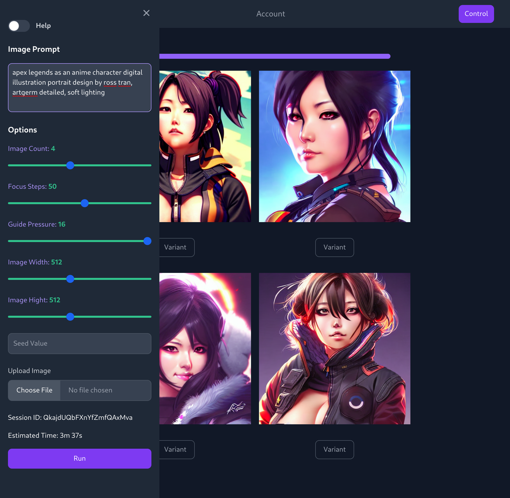
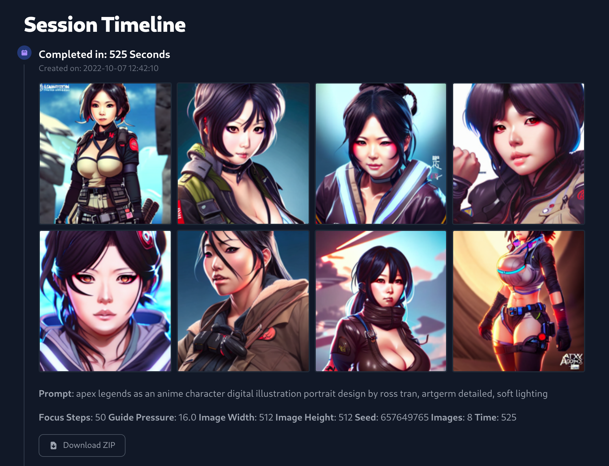
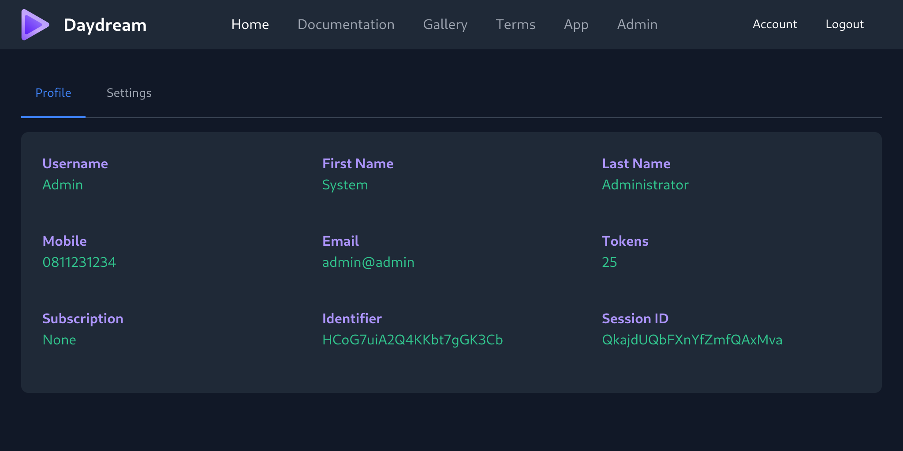
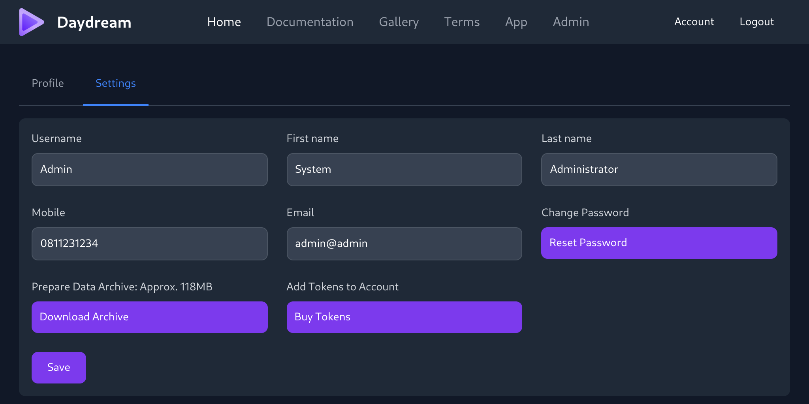
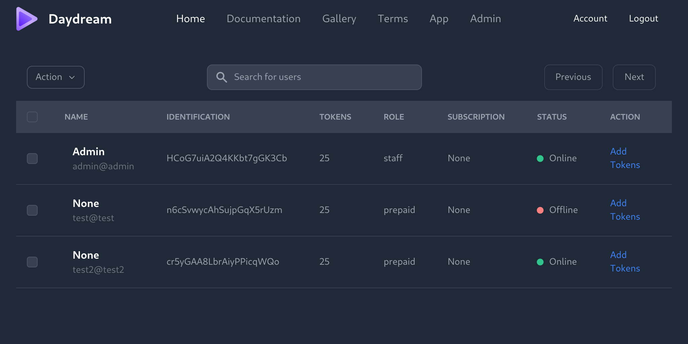

# Daydream: Flask Web Development Exercise

A Python and Flask Web Development exercise, I tasked myself over span of three weeks with creating a web-app that acts as a simplified interface to Stable Diffusion which is based on Flask and that makes use of `flask-sqlalchemy` to interface with the `sqlite` database, `flask-login` for authentication and user management, `flask-socketio` for progress messaging and `rq` for task queuing with the help of `redis`. Additionally `shortuuid` was used for creating unique identifiers for users, their sessions and their artworks with a low probability of collision, `pillow` for thumbnailing and general image processing, and `jinja2`, `tailwindcss`, and `flowbite` paired with the usual html, css and javascript for templating and DOM manipulation.

## Screenshots

<p align="center" width="100%">
  
</p>

I chose to go with a sidepanel to keep the UI clean. All the basic tunables are present and I added a help toggle to display more information about each setting inline. Each logged in session gets a session ID to keep track of their generated content. I would still like to implement a simple time estimate to give a potential user more tangible feedback.

<p align="center" width="100%">
  
</p>

The session timeline displays all tasks processed by the server from the user's respective session. The time to complete the task, the datetime the task was requested and a summary of the image generation prompt and settings are linked to each task. Users have the option of downloading images as ZIP archives.

<p align="center" width="100%">
  
</p>

The Account page is a simple tabbed area that shows the user an overview of their profile information and allows them to change their settings. Each user has a unique identifier and a unique session identifier that refreshes when logging in.

<p align="center" width="100%">
  
</p>

On the settings tab of the Account page, users can perform basic changes to their profile information, as well as change their passwords, add tokens to their accounts and request a downloadable archive of all the images linked to their account.

<p align="center" width="100%">
  
</p>

The Admin page allows users with staff privileges to see the state of users, their tokens and some identifying info. In the screenshot it is not fully hooked up to perform account modification.

## Design Requirements

I gave myself the following targets to hit with this exercise:

- A mock website that hooks into stable-diffusion as a service for general consumption
  - Landing, Documentation, Gallery, Terms for general browsing
  - State specific pages that appear to only staff or user accounts when logged in
  - Application page where the majority of the requests are handled between the user and the backend
  - Database to manage user accounts, their service requests and the content they generate
- Simplified web interface to access stable-diffusion
  - Prompt based image generation with steps, guidance and resolution sliders
  - Image to image generation from initial prompt based images or uploaded images
  - Timeline of images generated in given session paired with task details.
  - Ability to download batch of samples or all images in archive.
- Accounts and Authentication
  - User accounts (user editable)
  - Staff accounts
  - User credits (tokens)
  - User administration by staff accounts
- Process requests with a bounded FIFO task queue
  - Multiple requests limited to a single consumer GPU (Nvidia GTX 1060 6GB)

## DATABASE SCHEMA

Generated by `models.py` on first start.

### Users

```sql
CREATE TABLE user (
        id INTEGER NOT NULL, 
        uuid VARCHAR(42), 
        sessionid VARCHAR(42), 
        email VARCHAR(128), 
        mobile VARCHAR(12), 
        password VARCHAR(64), 
        tokens INTEGER, 
        username VARCHAR(32), 
        first_name VARCHAR(32), 
        last_name VARCHAR(32), 
        role VARCHAR(32), 
        state BOOLEAN, 
        subscription INTEGER, 
        date DATETIME, 
        PRIMARY KEY (id), 
        UNIQUE (uuid), 
        UNIQUE (sessionid), 
        UNIQUE (email)
);
```
### Tasks

```sql
CREATE TABLE task (
        id INTEGER NOT NULL, 
        user_id INTEGER, 
        sessionid VARCHAR(42), 
        prompt VARCHAR(512), 
        imgw INTEGER, 
        imgh INTEGER, 
        samples INTEGER, 
        steps INTEGER, 
        guide FLOAT, 
        seed INTEGER, 
        date DATETIME, 
        timer INTEGER, 
        state VARCHAR(32), 
        PRIMARY KEY (id), 
        FOREIGN KEY(user_id) REFERENCES user (id)
);
```

### Images

```sql
CREATE TABLE image (
        id INTEGER NOT NULL, 
        task_id INTEGER, 
        path VARCHAR, 
        uuid VARCHAR, 
        PRIMARY KEY (id), 
        FOREIGN KEY(task_id) REFERENCES task (id)
);
```

## TODO

Fixes and changes that fell outside the time I gave myself to get this put together.

### GENERAL WEBPAGE FIXES

- landing page disable subscribe button
- fix pricing bar's formatting on page scale
- add artwork to landing page
- fill out copy on Documentation page
- Gallery needs to auto populate from a data folder, should allow for some manual pruning
- Terms need to be filled

### ADMIN PAGE

- Admin panel needs to be hooked up to deal with users (just tokens and deleting users for now)

### CONTROL PANEL

- Control Panel Feedback on Estimated Time for Task
  - Create lookup table file that feeds javascript calculation on client-side
- Return Random Seed Value instead of defaulting to zero
  - remove default zero in database model
- Implement client side image scaling and size reduction in order to save on bandwidth
  - Resize & Compress Images In JAVASCRIPT
- control panel image generation time estimate
- control panel run button at the top instead of the bottom
- control panel limits on image size (no 768x768 images for instance)
- control panel text area placeholder flavour text
- close panel on submission

### APP PAGE

- Empty page needs full height div when not populated
  - create placeholder div and use jinja to swap out
- Implement Socket.io polling for task completion
  - link progress bar to polling
  - kill tasks in backend if user leaves app page (terminate active tasks, clear queue)
- Implement Progress Bar
  - Generating Feedback
  - Time remaining
  - Error Feedback/Failure Condition Responses
- Image Generation
  - populate images as they become available, swap out placeholders for user content
  - hook up variant button to populate control panel
- generate app loads with lots of whitespace, fix by adding dummy div on first load
- Only make the loading bar appear when the control panel has submitted a task
- add spinning indicator to show task in progress
- move progress bar above task history

## Start-Up

```bash
pipenv shell
cd site/
python app.py

sudo docker start redis-dev

pipenv shell
cd site/
rq worker -c qworker

cd site/
npx tailwindcss -i ./static/src/input.css -o ./static/dist/css/output.css --watch
```

## Notes

My goal here is only to gain more experience with Flask, if you're looking for a Stable Diffusion web ui that has state of the art capabilities, please see AUTOMATIC1111's amazing [stable-diffusion-webui](https://github.com/AUTOMATIC1111/stable-diffusion-webui).

Not included with in this repo: `database`, `css`, `js`. I've also made some minor changes to stable diffusion that aren't included in this repo. Those changes are limited to how user requests and progress reporting is handled with SQLite and offer no enhancement to SD itself. Cloning this repo will not give you a functional website.